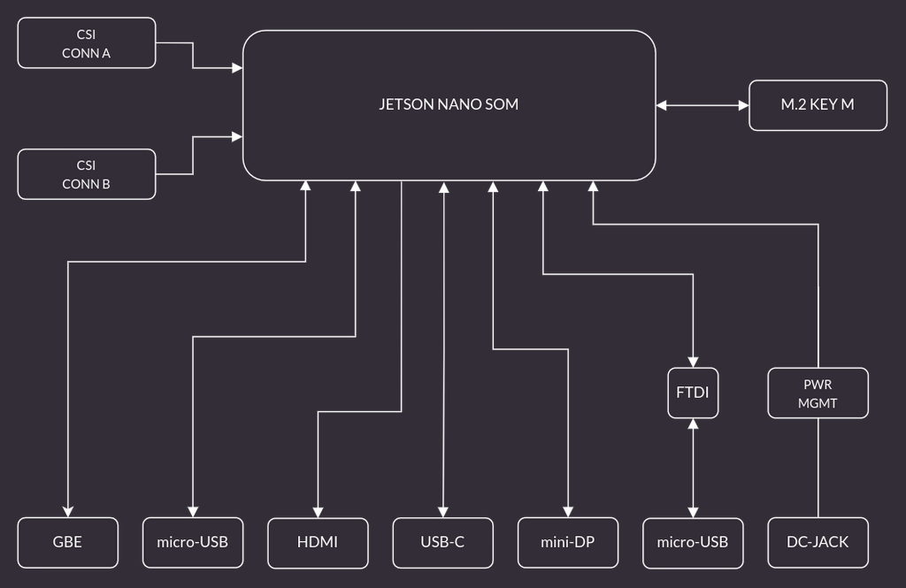

# Antmicro's Open Source Jetson Baseboard

Copyright (c) 2020-2023 [Antmicro](https://www.antmicro.com)

## Overview

This project contains open hardware design files for a baseboard supporting the NVIDIA Jetson Nano, Xavier NX and TX2 NX SoMs.
It was created by [Antmicro](https://antmicro.com), a custom hardware, software and AI engineering company and NVIDIA's Jetson ecosystem partner.
The board can be interfaced with MIPI CSI-2 video devices through a unified Flexible Flat Cable (FFC) connector, supporting up to 4 sensors in a 2-lane configuration or 3 sensors in a 4-lane configuration.
Please refer to the Product Design Guide for the relevant SoM for more details regarding the supported CSI lane mappings.
You will find the SoM-related resources in NVIDIA's [Jetson Download Center](https://developer.nvidia.com/embedded/downloads). 

The baseboard, its custom variants designed by Antmicro per customer's specification, and essential accessories can be purchased from [Capable Robot Components](https://capablerobot.com/products/nx-baseboard/).

The design files for this project starting from Rev. 1.5 are provided and maintained in KiCad.
Older revisions of the board were prepared in Altium Designer and are kept on a separate [branch](https://github.com/antmicro/jetson-nano-baseboard/tree/1.4.7-altium).

### Project structure:

The main directory contains the KiCad design files, LICENSE and README.
The remaining files are stored in the following directories:

* ``img`` - contains graphics for this README
* ``doc`` - contains generated schematics and other documentation
* ``lib`` - contains KiCad component library
* ``linux-patches`` - contains patches which add camera support for camera modules from Allied Vision (see the BSP section below)

## Key features

* Jetson Nano / Xavier NX / TX2 NX SO-DIMM connector
* Gigabit Ethernet RJ45 connector
* Micro USB debug connector
* USB-C DFP (Host) port
* Micro HDMI video output interface
* Mini DisplayPort video output interface
* 2x 50-pin FFC connectors exposing up to 4 MIPI CSI-2 camera interfaces
* M.2 (key M) connector exposing PCIe x4 interface
* RTC battery backup
* EEPROM for storing board ID/SN

## Getting started

The board can be produced and assembled using the provided design files.
Please take a look at the mechanical layers for more information regarding the PCB stackup recommended for fabrication.
The board can be powered by a voltage in the 6-36VDC range.
It is recommended to use a 12V 2A DC supply to power the board.
The board has an integrated power sequencer that starts the module automatically right after applying power supply.

### BSP

The baseboard's I/O interfaces are supported in the standard [Linux for Tegra (L4T) BSPs](https://developer.nvidia.com/embedded/linux-tegra) provided by NVIDIA for Jetson Nano / Xavier NX / TX2 NX. 
The BSP should work with the Open Source Jetson Baseboard out of the box.
However, to use the baseboard with various cameras and other accessories you may need to make modifications.
If you plan to use the board with Allied Vision [Alvium](https://www.alliedvision.com/en/products/embedded-vision-solutions/alvium-camera-modules-for-embedded-and-machine-vision-applications.html) image sensors, there is a ``linux-patches`` directory, which contains patch files that add support for the Allied Vision cameras for this baseboard with the Jetson Nano NX module.
The patches are named with the L4T release and can be applied to the corresponding branches of the Linux [repository](https://github.com/alliedvision/linux_nvidia_jetson) released by Allied Vision. 
Antmicro's services involve BSP development so you can hire us to make the necessary modifications for you.

You can use the USB OTG interface connector to upload a BSP image to a SoM inserted into the baseboard.

### Debug UART connection

Most of the debug messages are provided through the serial console.
The board includes an FTDI chip providing the UART interface to the host PC.
Please refer to the schematic sheets for more details.
The default debug UART channel is accessible through ``/dev/ttyUSB0`` (assuming that there are no other FTDI units connected to your PC).
The default baudrate for serial debug connection is 115200 baud with an 8-bit transmission, 1 stop bit and with no flow control.

### Revision info

The latest revision of the board (1.5.x) includes the design files converted into KiCad.
The BOM has been altered so the board can be produced despite the global chip shortage situation.
Revision 1.5.x changes the I2C multiplexer (PCA9548 -> PCA9547) used for handling the cameras and video accessories. 
You may need to adjust the devicetree entries for video accessories to make them work with the new I2C multiplexer chip.

## Block diagram

## License

This project is licensed under the [Apache-2.0](LICENSE) license.
