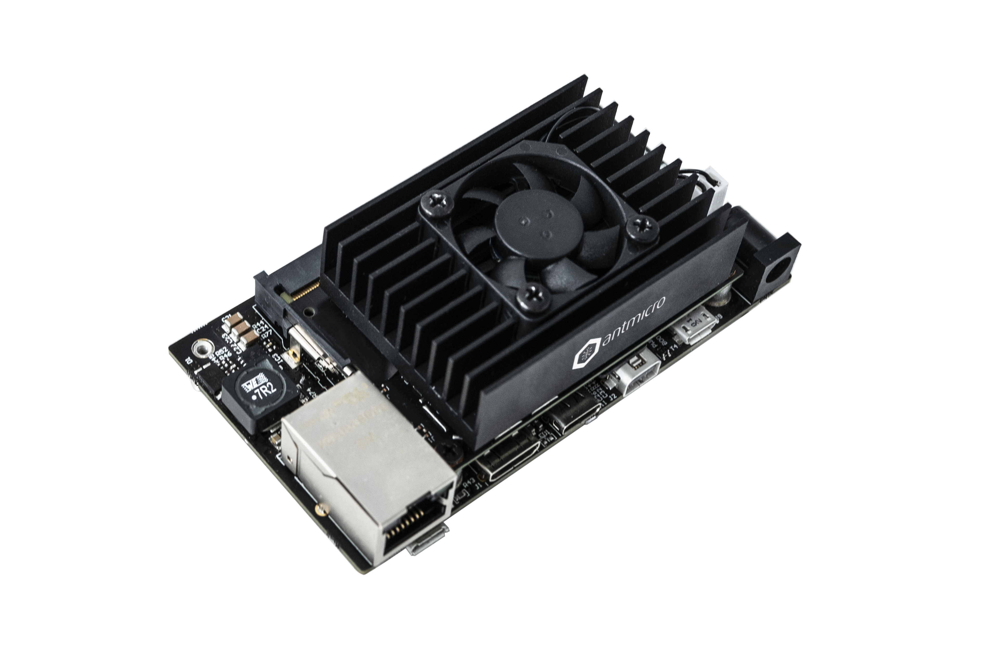
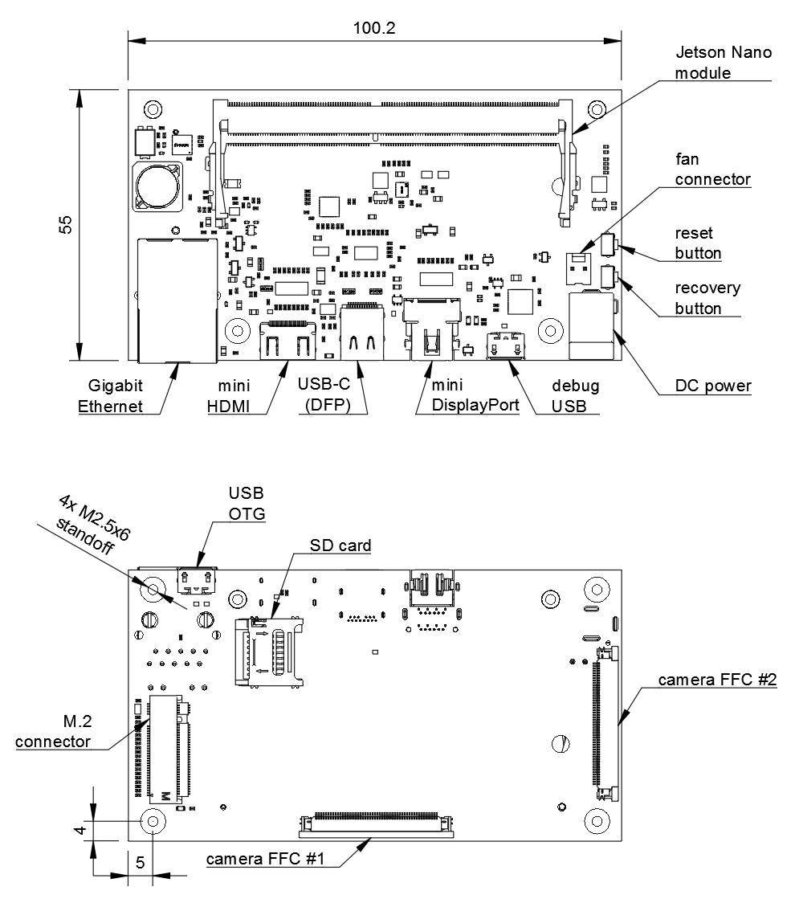

================================
Antmicro's Jetson Nano baseboard
================================

Overview
========

This repository contains open hardware design files for a baseboard supporting the NVIDIA Jetson Nano SoM, created by `Antmicro <www.antmicro.com>`_, Jetson ecosystem partner of `NVIDIA <www.nvidia.com>`_.
The board allows to interface with MIPI CSI-2 video devices through a unified Flexible Flat Cable (FFC) connector, supporting up to 4 sensors in a 2-lane configuration or 3 sensors in a 4-lane configuration.
Please refer to the ``Jetson Nano OEM Product Design Guide`` for more details regarding the supported CSI lane mappings.

Key features
============

* Jetson Nano SO-DIMM connector 
* Gigabit Ethernet RJ45 connector
* Micro USB debug connector
* USB-C DFP (Host) port
* Mini HDMI video output interface
* Mini Displayport video output interface 
* 2x 50-pin FFC connectors exposing MIPI CSI-2 camera interfaces

The PCB project files were prepared in Altium Designer 14.1.

Board layout & dimensions
=========================

The picture below presents the general layout of the PCB with IO interfaces marked.

Getting started
===============

The board can be produced and assembled using the provided design files.
Please take a look at the mechanical layers for more information regarding the PCB stackup recommended for fabrication.
The board accepts power supply voltage in the 6-36VDC range.
It is recommended to use a 12V 2A DC supply to power the board.
The board has an integrated power sequencer that starts the module automatically right after applying the power supply.

Debug UART connection
---------------------

Most of the debug messages are provided through the serial console.
The board is equipped with an FTDI chip exposing both UART interfaces to the host PC.
Please refer to the schematic sheets for more details.
The default debug UART channel is accessible through ``/dev/ttyUSB0`` (assuming that there are no other FTDI units connected to your PC).
The default baudrate for the serial debug connection is 115200 baud with 8-bit transmission, 1 stop bit and with no flow control.
